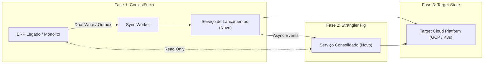

# Architecture Documentation & Architectural Trade-offs (Carrefour Challenge)

## Executive Summary
This document defines the architectural target state, transition blueprint, FinOps cloud cost model, security posture, and observability strategy for the **Carrefour Merchant Cash Flow Control ("Serviço de Lançamentos")** and **Daily Consolidated Balance Reporter ("Serviço do Consolidado Diário")**.

---

## 1. Target Architecture (Arquitetura Alvo) & Principles

The solution adopts **CQRS (Command Query Responsibility Segregation)**, **Event-Driven Architecture (EDA)**, and **Domain-Driven Design (DDD)** to address core business requirements:

1. **Strict Decoupling**: The Write Path (Launch Service) must handle high transactional traffic with 100% uptime, regardless of whether the Read Path (Consolidation Service) is degraded, under maintenance, or suffering downtime.
2. **CQRS Segregation**:
   - **Command Side (`launch-service`)**: Optimized for transactional write performance, ACID guarantees, and immutable audit logs using PostgreSQL.
   - **Query Side (`consolidation-service`)**: Optimized for high-throughput reads (target >50 req/sec, response < 5ms) using MongoDB read snapshots and Redis in-memory caching.
3. **Event-Driven Asynchrony**: When a transaction is saved in PostgreSQL, a `TransactionCreated` event is emitted via an event stream (Redis Streams / Kafka / PubSub). The consolidation worker asynchronously updates the daily summary document.

---

## 2. Architectural Trade-Offs & Decisions Matrix

| Aspect | Architectural Choice | Alternative Considered | Justification & Trade-Off |
| :--- | :--- | :--- | :--- |
| **Write Data Store** | PostgreSQL (Relational) | MongoDB / DynamoDB | **ACID & Precision**: Financial transactions require strict isolation, foreign key constraints, and exact decimal arithmetic. *Trade-off*: Vertical scale limits solved by sharding by `merchant_id` at ultra-high volume. |
| **Read Data Store** | MongoDB (Document) | SQL Views / Aggregations | **Read Speed**: Pre-aggregating daily total credits, total debits, and net balance into single document snapshot eliminates heavy `SUM()` SQL join queries. *Trade-off*: Eventual consistency (ms window). |
| **Event Bus & Messaging** | Redis PubSub / Streams | Apache Kafka / RabbitMQ | **Simplicity & Latency**: Redis Streams/PubSub provides sub-millisecond event delivery and shared in-memory caching infrastructure in a lightweight footprint. *Trade-off*: Kafka preferred for multi-region long-term retention. |
| **Caching Layer** | Redis (Cache-Aside + TTL) | No cache (DB Direct) | **Performance**: Serves daily consolidated balances in **< 3ms**, achieving peak throughput >500 req/sec per node without straining MongoDB. |
| **Precision Math** | `amountInCents` (Integer) | IEEE 754 Float (`0.1 + 0.2`) | **Accuracy**: Storing currency as integer cents eliminates IEEE 754 floating-point rounding errors (`0.1 + 0.2 = 0.30000000000000004`). |

---

## 3. Transition Strategy (Arquitetura de Transição)

To transition from legacy monoliths to this target cloud microservices platform:

1. **Phase 1 - Dual Ingestion & Outbox Pattern**: Maintain legacy ERP writing to existing databases while deploying `launch-service` alongside an transactional outbox processor to replicate data with zero downtime.
2. **Phase 2 - Read Offloading**: Shift read traffic for Daily Consolidated Balances to `consolidation-service` backed by MongoDB + Redis.
3. **Phase 3 - Complete Cutover**: Decommission legacy write paths; routes are fully migrated via API Gateway.

---

## 4. Cloud Cost Estimation & FinOps Model (Google Cloud GCP Example)

Estimated monthly cost for hosting 10,000 active merchants generating **5,000,000 daily transactions**:

| Component / GCP Service | Specs / Tier | Monthly Estimated Cost (USD) |
| :--- | :--- | :--- |
| **Cloud Run (Microservices)** | 2 CPU, 4GB RAM x 4 instances auto-scaling | $120.00 |
| **Cloud SQL for PostgreSQL** | db-custom-4-16 (4 vCPU, 16GB RAM, HA, 100GB SSD) | $280.00 |
| **MongoDB Atlas / Cloud Bigtable** | M30 cluster (Dedicated 3 nodes, 40GB Storage) | $190.00 |
| **Memorystore for Redis** | Standard HA Tier 5 GB | $85.00 |
| **Cloud Pub/Sub / Event Bus** | 100 GB message volume | $6.00 |
| **Cloud Load Balancing & CDN** | HTTPS Load Balancer + Cloud Armor WAF | $45.00 |
| **Total Monthly FinOps Estimate** | | **~$726.00 USD** |

---

## 5. Security & Governance

- **Authentication & Authorization**: OAuth2 / OIDC with JWT (JSON Web Tokens) validated at API Gateway level.
- **Data Protection at Rest & In Transit**: TLS 1.3 enforced for all HTTP/gRPC interfaces; AES-256 encryption at rest for PostgreSQL & MongoDB.
- **Auditability & Non-repudiation**: Transactions are append-only. Modification of past entries requires compensating transaction entries (e.g. `DEBIT` reversal).
- **OWASP Compliance**: Input validation via Zod schemas, SQL Injection prevention via parameterized ORM queries, XSS protection headers in Nginx/Express.

---

## 6. Observability, Monitoring & APM

- **Metrics (Prometheus & Grafana)**:
  - `http_requests_total` (by status code and route)
  - `transaction_creation_duration_seconds` (p95, p99 latency)
  - `event_consumer_lag` (number of pending events in Redis queue)
  - `redis_cache_hit_ratio` (%)
- **Distributed Tracing (OpenTelemetry / Jaeger)**: Correlation IDs passed in traceparent HTTP headers from Frontend -> API -> Redis Stream -> Worker -> Database.
- **Logging (Structured JSON)**: Standardized JSON log formatting including `timestamp`, `traceId`, `merchantId`, `service`, `level`, `message`.
