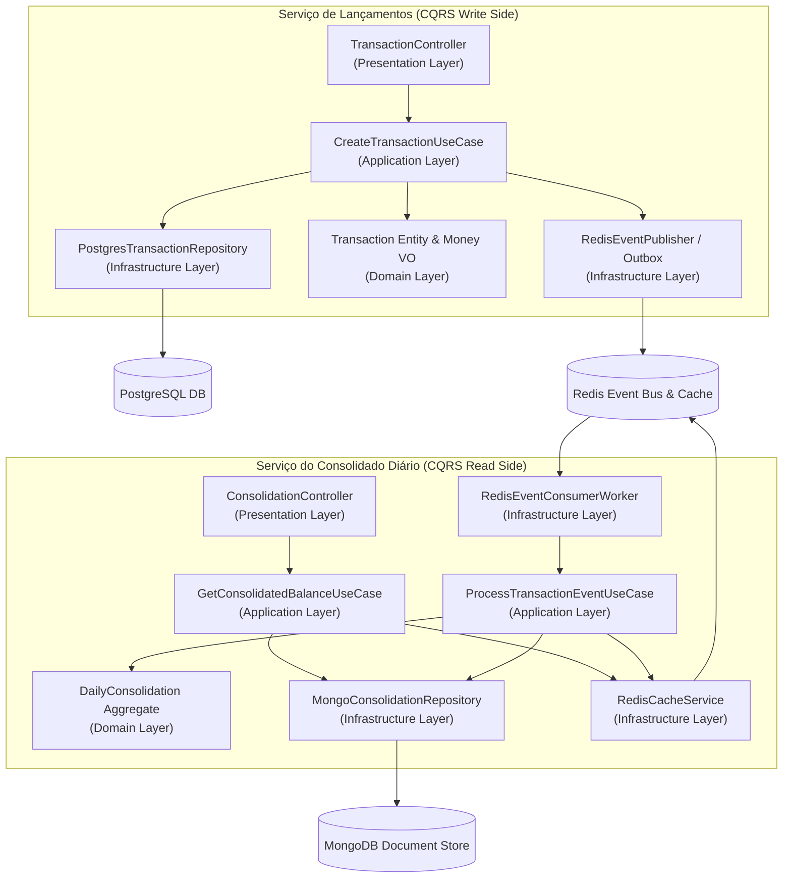

# C4 Model - Component Diagram (Level 3)

This diagram Details the internal DDD components of both microservices (`launch-service` and `consolidation-service`).

```mermaid
graph TB
    subgraph LaunchService["Serviço de Lançamentos (CQRS Write Side)"]
        direction TB
        L_Ctrl["TransactionController<br/>(Presentation Layer)"]
        L_UC["CreateTransactionUseCase<br/>(Application Layer)"]
        L_Repo["PostgresTransactionRepository<br/>(Infrastructure Layer)"]
        L_Domain["Transaction Entity & Money VO<br/>(Domain Layer)"]
        L_EventPub["RedisEventPublisher / Outbox<br/>(Infrastructure Layer)"]

        L_Ctrl --> L_UC
        L_UC --> L_Domain
        L_UC --> L_Repo
        L_UC --> L_EventPub
    end

    subgraph ConsolidationService["Serviço do Consolidado Diário (CQRS Read Side)"]
        direction TB
        C_Ctrl["ConsolidationController<br/>(Presentation Layer)"]
        C_UC["GetConsolidatedBalanceUseCase<br/>(Application Layer)"]
        C_EventSub["RedisEventConsumerWorker<br/>(Infrastructure Layer)"]
        C_ProcUC["ProcessTransactionEventUseCase<br/>(Application Layer)"]
        C_Domain["DailyConsolidation Aggregate<br/>(Domain Layer)"]
        C_Repo["MongoConsolidationRepository<br/>(Infrastructure Layer)"]
        C_Cache["RedisCacheService<br/>(Infrastructure Layer)"]

        C_Ctrl --> C_UC
        C_UC --> C_Cache
        C_UC --> C_Repo
        C_EventSub --> C_ProcUC
        C_ProcUC --> C_Domain
        C_ProcUC --> C_Repo
        C_ProcUC --> C_Cache
    end

    Postgres[("PostgreSQL DB")]
    Redis[("Redis Event Bus & Cache")]
    Mongo[("MongoDB Document Store")]

    L_Repo --> Postgres
    L_EventPub --> Redis
    Redis --> C_EventSub
    C_Repo --> Mongo
    C_Cache --> Redis
```
