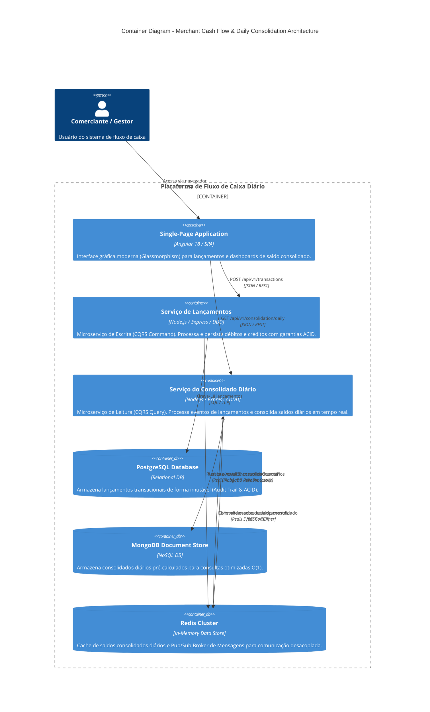

# C4 Model - Container Diagram (Level 2)

This diagram shows the high-level technical containers: Frontend SPA, Microservices (Launch Service & Consolidation Service), Databases (PostgreSQL & MongoDB), and Event Bus / Cache (Redis).

