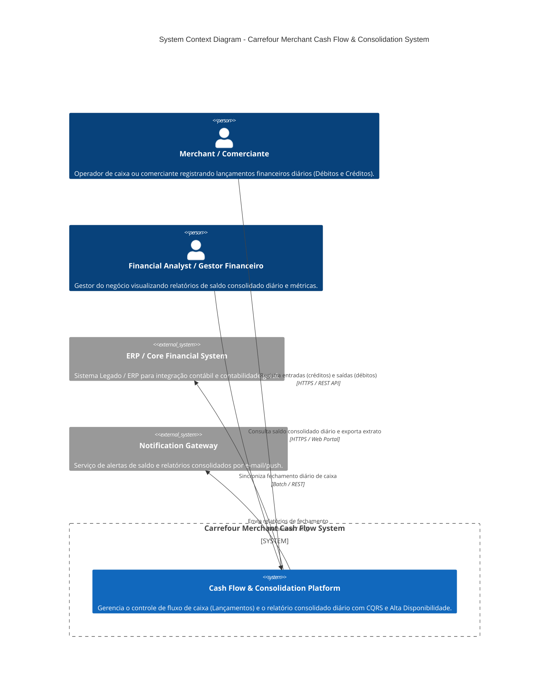

# C4 Model - System Context Diagram (Level 1)

This diagram illustrates the Cash Flow Control System in context with external users and external enterprise systems.

```mermaid
C4Context
    title System Context Diagram - Carrefour Merchant Cash Flow & Consolidation System

    Person(merchant, "Merchant / Comerciante", "Operador de caixa ou comerciante registrando lançamentos financeiros diários (Débitos e Créditos).")
    Person(finance_analyst, "Financial Analyst / Gestor Financeiro", "Gestor do negócio visualizando relatórios de saldo consolidado diário e métricas.")

    System_Boundary(b0, "Carrefour Merchant Cash Flow System") {
        System(cash_flow_system, "Cash Flow & Consolidation Platform", "Gerencia o controle de fluxo de caixa (Lançamentos) e o relatório consolidado diário com CQRS e Alta Disponibilidade.")
    }

    System_Ext(legacy_erp, "ERP / Core Financial System", "Sistema Legado / ERP para integração contábil e contabilidade geral.")
    System_Ext(notification_svc, "Notification Gateway", "Serviço de alertas de saldo e relatórios consolidados por e-mail/push.")

    Rel(merchant, cash_flow_system, "Registra entradas (créditos) e saídas (débitos)", "HTTPS / REST API")
    Rel(finance_analyst, cash_flow_system, "Consulta saldo consolidado diário e exporta extrato", "HTTPS / Web Portal")
    Rel(cash_flow_system, legacy_erp, "Sincroniza fechamento diário de caixa", "Batch / REST")
    Rel(cash_flow_system, notification_svc, "Envia relatórios de fechamento", "Webhooks / MQ")
```
