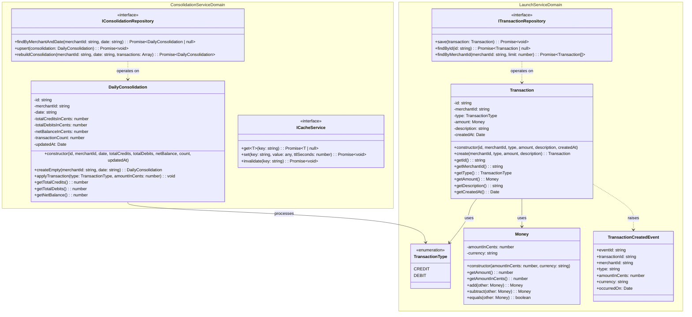

# Domain Model UML Class Diagram

This diagram displays the Domain-Driven Design (DDD) domain entities, aggregates, value objects, domain events, repositories, and interfaces for both microservices.

