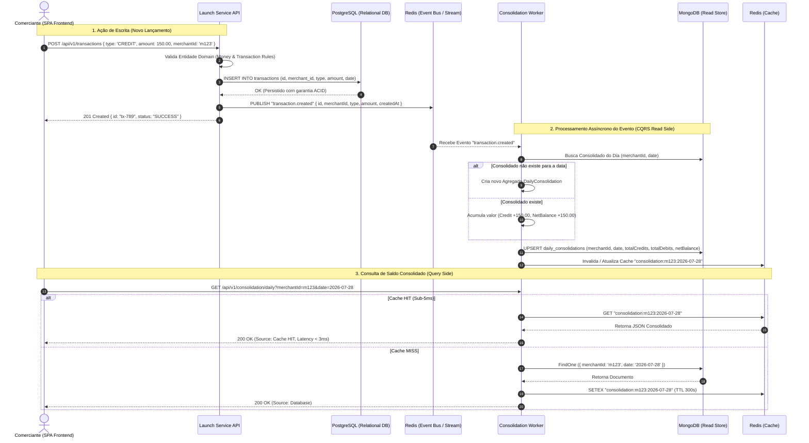

# Event Flow & Sequence Diagram

This diagram shows the complete asynchronous end-to-end execution flow of a transaction, showing how CQRS and Event-Driven Architecture decouple the write path from the consolidation query path.

